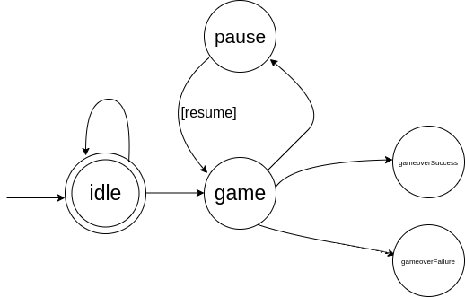

# Find All Pairs - Card Game

## Description

The "Find All Pairs" card game is a web-based project developed to showcase my JavaScript skills and what I've learned during my recent JavaScript course. The game's objective is to find and match all pairs of cards within the shortest time possible. It's a fun and challenging way to test your memory and concentration.

## Key Features

- **Card Shuffling**: The game shuffles the cards at the beginning of each round, providing a unique and unpredictable experience every time you play.

- **Intuitive Game Logic**: The project incorporates an intuitive game logic that keeps track of your progress, ensuring a smooth and enjoyable gaming experience.

- **User-Friendly Interactions**: The user interface is designed for ease of use, allowing players to flip and match cards with simple clicks.

- **Responsive Design**: The game is responsive and adapts to various screen sizes, making it accessible and enjoyable on desktops, tablets, and mobile devices.

- **Immersive Sound Effects**: Experience an immersive atmosphere with sound effects that enhance the gaming experience.

## Getting Started

To get started and play "Find All Pairs," you can visit [the project demo](https://findallpairs.netlify.app/) and start enjoying the game right away.

## License

This project is licensed under the [Creative Commons Attribution-NonCommercial-NoDerivatives 4.0 International License (CC BY-NC-ND 4.0)](https://creativecommons.org/licenses/by-nc-nd/4.0/).

# Game FSM

1. from idle state we can get only to game state
2. from game state we can get only to pause, idle, gameoverSuccess, gameoverFailure states and cannot get to game state again
3. from pause state we can get only idle and game states, but not gameoverSuccess, gameoverFailure states
4. resume state is only for additional condition, and we never get that state
5. to gameoverSuccess, gameoverFailure states we can only get from game state
6. we cannot get from gameoverSuccess state to gameoverFailure state
7. we cannot get from gameoverFailure state to gameoverSuccess state
8. from any state, except 'resume' we can get to idle state
