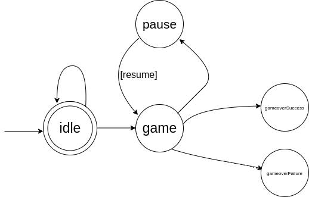

# Game FSM

1. from idle state we can get only to game state
2. from game state we can get only to pause, idle, gameoverSuccess, gameoverFailure states and cannot get to game state again
3. from pause state we can get only idle and game states, but not gameoverSuccess, gameoverFailure states
4. resume state is only for additional condition, and we never get that state
5. to gameoverSuccess, gameoverFailure states we can only get from game state
6. we cannot get from gameoverSuccess state to gameoverFailure state
7. we cannot get from gameoverFailure state to gameoverSuccess state
8. from any state, except 'resume' we can get to idle state
